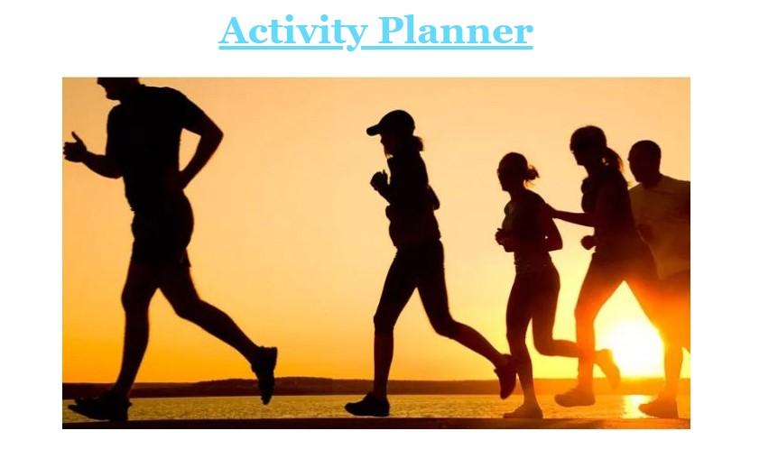

# Activity Planner

## About the Application

*This application is a website where users can find new activities to do or favorite activities that they want to participate in.*

This repository only contains the frontend of this application. The backend repository can be accessed [here](https://github.com/AndrewLeRoux/phase-3-project-backend)

## Functionality

A user is able to create an account or login into an existing profile. Once logged in they will be able to access their profile page, an activities list page, and a favorited activites page. What is rendered on the page is specific to each user. Each user selects activity preferences when creating their account which will affect which activities that are recommended to them, and any activities they favorite will be saved to the database and be specific to their account. All information will persist in the database and will be saved when the user logs out. 

## Resources

This project was bootstrapped with [Create React App](https://github.com/facebook/create-react-app).

### `npm start`

Runs the app in the development mode.\
Open [http://localhost:3000](http://localhost:3000) to view it in your browser.

The page will reload when you make changes.\
You may also see any lint errors in the console.

__Images__
*the following hyperlinks are for the images that were used in this project(staff and athlete photos)*

[https://www.hhmglobal.com/wp-content/uploads/news/29784/Exersize-696x393.jpg](https://www.hhmglobal.com/wp-content/uploads/news/29784/Exersize-696x393.jpg)

[https://upload.wikimedia.org/wikipedia/commons/thumb/7/7c/Sonne_Meer_und_M%C3%B6we.jpg/400px-Sonne_Meer_und_M%C3%B6we.jpg](https://upload.wikimedia.org/wikipedia/commons/thumb/7/7c/Sonne_Meer_und_M%C3%B6we.jpg/400px-Sonne_Meer_und_M%C3%B6we.jpg)

[https://www.habitatbroward.org/wp-content/uploads/2020/01/10-Benefits-Showing-Why-Education-Is-Important-to-Our-Society.jpg](https://www.habitatbroward.org/wp-content/uploads/2020/01/10-Benefits-Showing-Why-Education-Is-Important-to-Our-Society.jpg)

[https://www.hhmglobal.com/wp-content/uploads/news/29784/Exersize-696x393.jpg](https://www.hhmglobal.com/wp-content/uploads/news/29784/Exersize-696x393.jpg)

[https://publir.com/blog/wp-content/uploads/2021/09/Social_media.jpg](https://publir.com/blog/wp-content/uploads/2021/09/Social_media.jpg)

[https://www.moneycrashers.com/wp-content/uploads/2018/11/diy-do-it-yourself-wooden-block-letters.jpg](https://www.moneycrashers.com/wp-content/uploads/2018/11/diy-do-it-yourself-wooden-block-letters.jpg)

[https://www.usnews.com/dims4/USNEWS/9b62b7c/2147483647/crop/2000x1313%2B0%2B4/resize/640x420/quality/85/?url=http%3A%2F%2Fmedia.beam.usnews.com%2Fa9%2Fe8%2F046d240745f590f48c4d6067a9f5%2F200923-stock.jpg](https://www.usnews.com/dims4/USNEWS/9b62b7c/2147483647/crop/2000x1313%2B0%2B4/resize/640x420/quality/85/?url=http%3A%2F%2Fmedia.beam.usnews.com%2Fa9%2Fe8%2F046d240745f590f48c4d6067a9f5%2F200923-stock.jpg)

[https://media-cldnry.s-nbcnews.com/image/upload/newscms/2019_41/3044956/191009-cooking-vegetables-al-1422.jpg](https://media-cldnry.s-nbcnews.com/image/upload/newscms/2019_41/3044956/191009-cooking-vegetables-al-1422.jpg)

[https://media.istockphoto.com/vectors/music-note-icon-vector-illustration-vector-id1175435360?k=20&m=1175435360&s=612x612&w=0&h=1yoTgUwobvdFlNxUQtB7_NnWOUD83XOMZHvxUzkOJJs=](https://media.istockphoto.com/vectors/music-note-icon-vector-illustration-vector-id1175435360?k=20&m=1175435360&s=612x612&w=0&h=1yoTgUwobvdFlNxUQtB7_NnWOUD83XOMZHvxUzkOJJs=)

[https://thumbs.dreamstime.com/b/multitasking-vector-illustration-flat-tiny-busy-work-list-persons-concept-job-management-overload-lifestyle-abstract-time-pressure-144407520.jpg](https://thumbs.dreamstime.com/b/multitasking-vector-illustration-flat-tiny-busy-work-list-persons-concept-job-management-overload-lifestyle-abstract-time-pressure-144407520.jpg)
